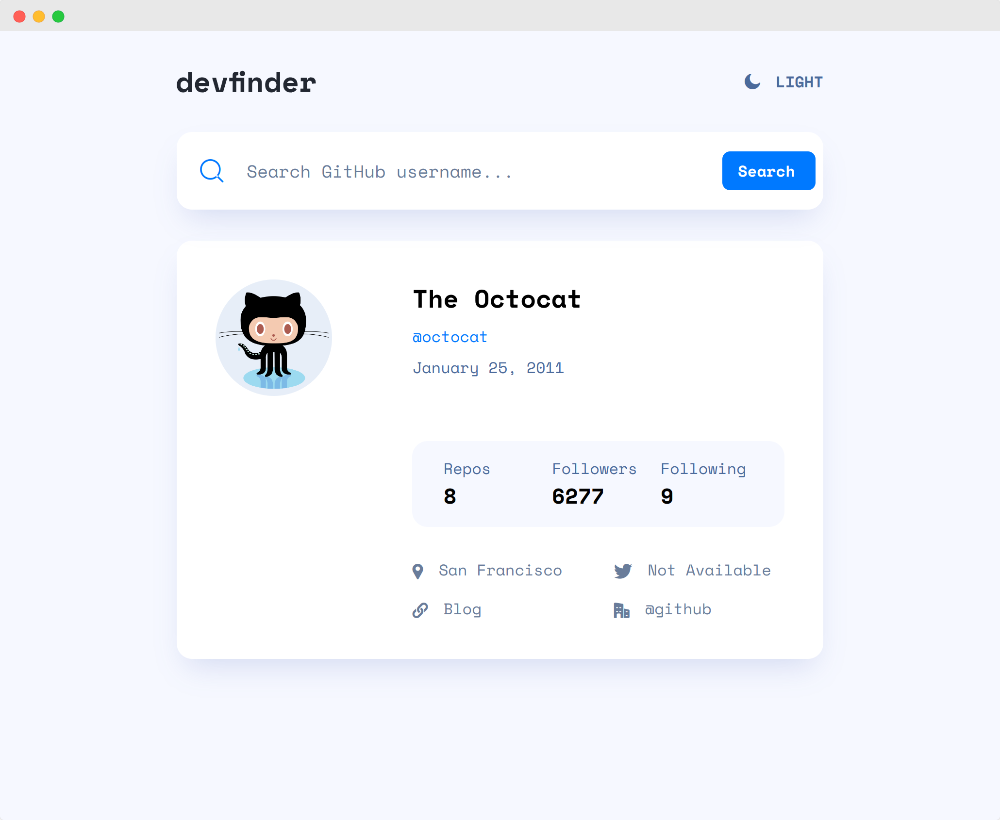

# FrontendMentor Challenge | GitHub User Search App

This is a challenge from FrontendMentor.   
You can find the description of the task here:   
[frontendmentor.io](https://www.frontendmentor.io/challenges/github-user-search-app-Q09YOgaH6)



My goal in this challenge was to:
- Make my first steps with VueJS

### How to run
```bash
git clone https://github.com/jeromehaas/github-user-search-app-fm
cd github-user-search-app-fm
nvm use
npm install 
npm start
```